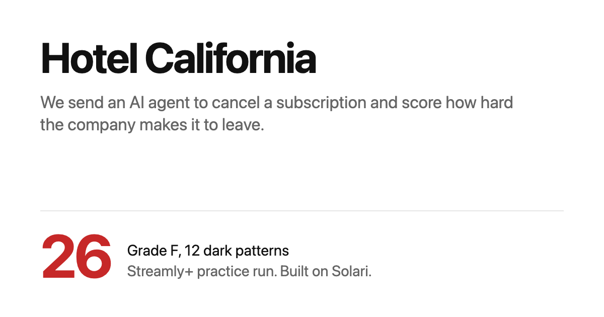
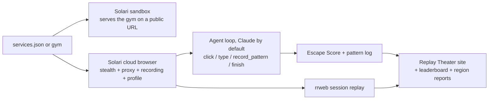

# Hotel California

*You can check out any time you like. This agent checks whether you can actually leave.*

Hotel California is an AI agent that cancels subscriptions on your own accounts,
counts every dark pattern the company throws at it on the way out, and scores
the experience. The output is a **Cancellation Difficulty Index**: a public
leaderboard of who lets you leave with dignity and who makes you fight for it,
with a DOM-level session replay of every run as the receipt.

Built on [Solari](https://getsolari.com) cloud browsers and sandboxes. The agent
runs on Claude Sonnet 5.5 by default, or on any model with tool calling through
an OpenAI-compatible API.

**[Watch the replays](https://iamdejman.github.io/hotel-california/)**: the
agent's first checkout, from the Streamly+ practice gym, scored **26/100
(grade F)** with 12 dark patterns on the bill.

[](https://iamdejman.github.io/hotel-california/runs/gym.html)

## Who needs this

The leaderboard is the hook; the workflows underneath are ones people already
pay for:

- **Cancel-for-you services.** Rocket Money and Trim charge real money to
  cancel subscriptions for their members, today, with human agents filling out
  these flows. This is that job automated, with a recorded proof-of-cancellation
  for the customer file.
- **Click-to-cancel compliance.** The FTC's click-to-cancel rule and
  California's law require cancelling to be as easy as signing up. Point the
  agent at your own product from multiple jurisdictions and get a scored,
  replayable audit before a regulator runs the same experiment.
- **Dark-pattern research.** Regulators, consumer groups, and academics
  document these flows by hand today. This traverses them, classifies against a
  taxonomy, and emits replayable evidence.

## How it works



## Why this needs Solari

- **Session recording**: every run is captured as an rrweb replay at create
  time (`recording: true`). The leaderboard is not a vibe, it is evidence you
  can scrub through frame by frame.
- **Persistent profiles**: you log in to a service once, save the profile, and
  every scored run after that starts already authenticated. No credentials in
  the loop, ever.
- **Stealth + residential proxies**: cancellation pages love to treat
  datacenter traffic as a bot and quietly break. Stealth mode and residential
  egress make the run look like the paying customer it represents.
- **Sandboxes with public preview URLs**: the bundled practice gym deploys
  itself into a Solari sandbox and comes back with a public URL, because a
  cloud browser cannot see your localhost. One API key runs both halves.

## The Escape Score

Every run starts at 100 and bleeds points for friction:

| Obstacle | Penalty |
| --- | --- |
| Forced channel switch (call or chat to cancel) | -25 |
| Hidden cancellation path | -8 |
| Retention offer wall | -8 |
| Visual misdirection / confirmshaming | -6 |
| Guilt-trip screen / price-hike threat | -5 |
| Forced exit survey / fake urgency / artificial delay | -4 |
| Each are-you-sure screen past the first | -3 |
| Each click past the third | -2 |
| Each minute past the second | -3 |

90+ is an A: they let you go like adults. Under 40 is an F: welcome to the
Hotel California. A run that never gets out, whether it hits "call us to cancel",
a CAPTCHA, or a dead end, is an automatic F.

**Where the numbers come from.** The categories follow published dark-pattern
research: Harry Brignull's [deceptive.design](https://www.deceptive.design/types),
the FTC staff report
[Bringing Dark Patterns to Light](https://www.ftc.gov/reports/bringing-dark-patterns-light)
(2022), and Mathur et al.,
[Dark Patterns at Scale](https://arxiv.org/abs/1907.07032) (2019). The weights
are my own judgement and follow one rule: the more a pattern stops you from
leaving, the more it costs. Being sent to a phone line can stop you outright, so
it costs 25. An extra confirm screen only slows you down, so it costs 3. They
are not calibrated against user data. To change them, edit `PATTERN_WEIGHTS` in
[`src/score.ts`](src/score.ts).

Results land in [`LEADERBOARD.md`](LEADERBOARD.md).

## Quick start: fight the gym

The repo ships with **Streamly+**, a fictional streaming service whose
cancellation flow contains eight dark patterns on purpose: a footer-buried
cancel link, a mandatory survey, a 50% retention offer with a fake countdown,
a guilt screen, confirmshamed buttons, a fake "specialist" wait, and a final
grandfathered-price threat.

Requires Node 22 or newer.

```bash
npm install
cp .env.example .env   # add SOLARI_API_KEY and ANTHROPIC_API_KEY
npm start -- gym
npm run site           # open site/index.html
```

What happens, all on one Solari key:

1. A sandbox microVM boots, the gym is written into it, and a public preview
   URL comes back.
2. A stealth cloud browser launches with recording on.
3. Claude navigates the flow: finds the buried link, answers the survey
   minimally, declines the bribe, survives the guilt trip, waits out the fake
   specialist, and confirms.
4. You get the score, the pattern list with quoted evidence, the JSON result,
   and the replay file.

Output from the published run (quotes trimmed):

```
  outcome : cancelled
  escape score : 26/100 (grade F)
  dark patterns : 12
    - hidden_path: "continue to membership cancellation" buried at the very bottom
    - retention_offer: "Pause your membership for up to 3 months"
    - forced_survey: "We can't continue until you tell us why you're thinking of leaving."
    - retention_offer: "50% off for 3 months"
    - fake_urgency: "This one-time offer expires in 4:57"
    - misdirection: "Claim my 50% discount" is the prominent button
    - guilt_trip: "Your watchlist will miss you."
    - confirmshaming: "Yes, take it all away from me"
    - repeated_confirmation: "Are you sure you want to give up the things you love?"
    - artificial_delay: "Connecting you to a cancellation specialist."
    - price_hike_threat: "If you cancel, this price is gone forever."
    - repeated_confirmation: "Are you absolutely sure?"
  clicks 8, pages 8, 115s
```

## What has been tested

| Run | Result |
| --- | --- |
| Practice site, Claude Opus 4.6 (the published run) | Cancelled. 26/100, grade F, 12 dark patterns |
| Practice site, Claude Sonnet 5.5 (the default) | Cancelled. 30/100, grade F, 11 dark patterns, 49s |
| Practice site from the US and UK (`--regions us,gb`) | Both cancelled through residential proxies. Scores within 3 points |
| Practice site through the OpenAI-compatible path (Claude via its compatible endpoint) | Cancelled. 30/100, grade F, 11 dark patterns, 51s. Other providers use the same path but have not been run |
| Real sites, logged out (Netflix, New York Times) | Both stopped at the login wall and reported "needs a human" with no false dark patterns. Not published |
| A real subscription, logged in | Not run yet. It needs a saved login profile and a subscription you are willing to cancel |

The real-site runs found two bugs the practice site never showed: a redirect
during page reading crashed the run, and long session IDs broke replay
filenames. Both are fixed.

## Choosing a model

The agent runs on Claude Sonnet 5.5 by default. Set `AI_MODEL` in `.env` to use
another Claude model.

To use another provider, point it at any OpenAI-compatible API. The model must
support tool calling.

```bash
AI_PROVIDER=openai
OPENAI_API_KEY=...
OPENAI_BASE_URL=https://generativelanguage.googleapis.com/v1beta/openai/   # Gemini; leave unset for OpenAI
AI_MODEL=gemini-2.5-pro
```

The same settings work for OpenAI, OpenRouter, Groq, and a local Ollama
(`OPENAI_BASE_URL=http://localhost:11434/v1`). Results depend on the model: a
small model may miss dark patterns or get stuck.

## Scoring a real service

For a page that needs no login, pass its URL:

```bash
npm start -- https://your-site.com/account
```

For a page behind a login:

1. Add the service to `services.json` with the account page URL and a profile
   name.
2. Log in once and save the profile under that name (adapt
   [browser-profiles-ts](https://github.com/solari-sdk/solari-cookbook/tree/main/examples/browser-profiles-ts)
   from the Solari cookbook to your service's login flow). After this the agent
   never touches credentials.
3. Run it:

```bash
npm start -- your-service
```

4. Regenerate the leaderboard any time with `npm run leaderboard`.

## The Replay Theater

`npm run site` builds a static site in `site/`. Every run gets a **checkout
bill**: each dark pattern is an itemized charge against a starting balance of
100, so the Escape Score shows its working. Above the bill sits the **session
replay**, with a red marker on the timeline for every charge. Press "Watch it
happen" on any line and the player jumps to that moment. Set `SITE_URL` when
building for a public host to add link-preview tags, then publish `site/` on
GitHub Pages.

## The jurisdiction experiment

Regulators in different places have different rules about how easy cancelling
must be, and companies are known to serve different flows by region. So run the
same cancellation through residential egress in several countries and diff the
exits:

```bash
npm start -- your-service --regions us,gb,de
```

Each region gets its own scored run and replay, and
`reports/your-service-regions.md` comes out as a compliance-style finding:
score per region, which dark patterns appeared where, and whether customers
are being offered the same door out. If the exit is easier from one
jurisdiction than another, you now have replayable evidence of it.

## Ground rules

This tool is for cancelling **your own** subscriptions and documenting the
experience, which you are entitled to do.

- The agent refuses to enter payment details, passwords, or personal data.
- It does not solve CAPTCHAs. If one appears, it stops and hands back to you.
- If cancellation requires talking to a human, it records the `channel_switch`
  pattern and stops. It will not impersonate you in a live conversation.
- Do not run it against accounts that are not yours.

## Repo map

```
src/index.ts    orchestrator: launch, run (per region), score, save, report
src/agent.ts    the agent loop and its tools (click, type, record_pattern, finish)
src/model.ts    the model behind it: Anthropic, or any OpenAI-compatible API
src/browser.ts  page observation: tagged interactive elements + text digest
src/score.ts    the Escape Score rubric
src/gym.ts      deploys the gym into a Solari sandbox with a public URL
src/results.ts  loads results/*.json, worst score first
src/report.ts   builds LEADERBOARD.md from results/*.json
src/compare.ts  builds the per-region compliance finding in reports/
src/site.ts     builds the Replay Theater static site in site/
gym/            Streamly+, the eight-pattern practice gym
results/        one JSON per scored run (service, or service@region)
replays/        rrweb session replays (gitignored; copied into site/ on build)
site/           the Replay Theater (publish to GitHub Pages)
```

## License

MIT. The Eagles are not affiliated and would probably want you to be able to leave.
